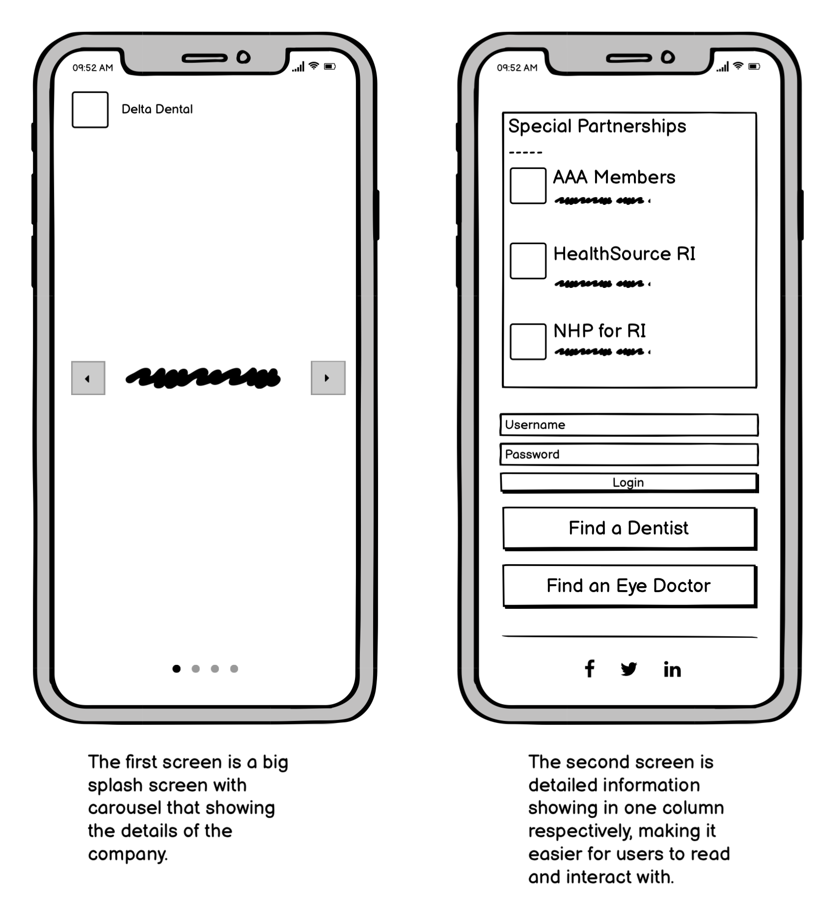

# Responsive Redesign

## Identifying Usability Problems

### Picking a Web Page

The website I choose is [Delta Dental of Rhode Island](https://www.deltadentalri.com/). I choose it because it is a local site that I occasionally came up with. 

Here is a screenshot of it.

### Finding Problems

The main problem with this website is that is not responsive at all. Look at this screenshot taken from a phone, you can see that the fonts are extremely small that is very hard to read. You need to make it larger to see the details.

Besides that, there are some minor problems as well:

- The carousel on the top of the page didn't automatically scroll.
- There are too many descriptive text below the login area.
- There are texts fixed in the picture that cannot scale with different viewports.

### Accessibility

Using the WebAIM WAVE, I find there are 5 errors and 17 alerts on this page. The errors are mainly about missing alt texts or languages. The alerts are about redundant links and alternative texts. 

I agree with the problems detected. Because if a user access this website with accessbility issue, missing alt texts will let him don't know what it the corresponding part about and  redundant things will take him longer time to skip. All these will hurt the user experience.

## Visual Redesign

### Low-fidelity Wireframing

### Visual Design Style Guide

For the redesign, I choose to use green as the theme color because the original website's main color is green and I used  [Material Design for Bootstrap](https://mdbootstrap.com/docs/standard/)'s basic styles.

### High-Fidelity Prototyping

I'm using the BootStrap's grid system, the main responsive part is annotated in the large screen view. The website will be responsive when the viewport changes. You can see the layout on a phone and a tablet here.

Besides that, I also set the carousel to be 100% of the height if the screen is smaller than 576px.

## Responsive Redesign

[Link to the redesigned website](https://superpig666.github.io/responsive/redesign.html).

## References

For this project I used [Material Design for Bootstrap](https://mdbootstrap.com/docs/standard/) as the CSS framework.